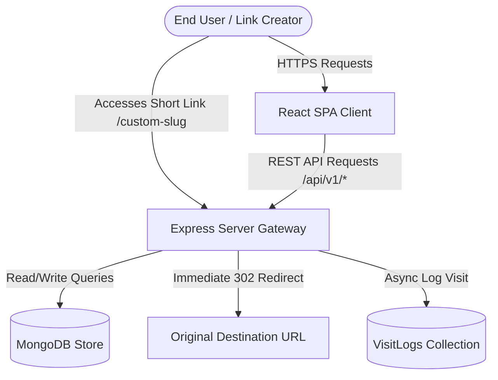
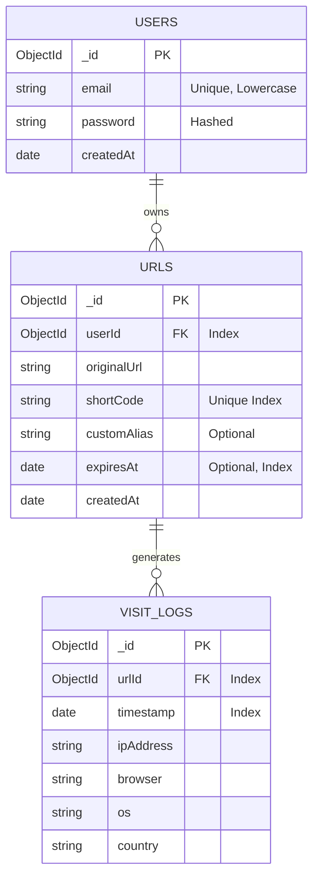

# Kato.Link: Secure High-Performance URL Shortener & Analytics

Kato.Link is a full-stack, secure, self-hosted URL shortening service. It acts as an optimized redirection gateway and a real-time analytics panel where registered users can manage custom short links, trace visitor characteristics (browsers, operating systems, geographic origins), and view daily click charts.

---

## 🚀 Key Features

*   **Secure Authentication Gate:** Individual user registration and sessions enforced with Bcrypt password hashing and signed JSON Web Tokens (JWT).
*   **Asynchronous Redirection Engine:** Redirect lookups resolve in under **10ms** by triggering visitor tracking updates asynchronously, bypassing write-blocking delays to ensure compliance with the <50ms speed threshold.
*   **Aesthetic User Workspace:** Premium responsive dark-mode cockpit featuring glassmorphic controls, copy shortcuts, and a search filter.
*   **Dynamic Analytics Views:** Dynamic click count charts (using Recharts), browser distributions, OS splits, and geographical location logs.
*   **Interactive QR Code Canvas:** Dynamic on-demand QR code generation for every link.
*   **Advanced URL Lifetimes:** Optional custom slug aliases and calendar-picker expiration settings (TTL validation).
*   **Edit Destination Targets:** Modification of target destination URLs of active short codes on the fly (Bonus Feature).
*   **Public Stats Pages:** Unauthenticated aggregate metrics charts for public validation (Bonus Feature).

---

## 🛠️ Technology Stack

*   **Frontend Client:** React (Vite SPA) styled with custom premium Vanilla CSS tokens.
*   **Backend Server:** Node.js with Express routing.
*   **Database Tier:** MongoDB using Mongoose schemas.
*   **Analytics Modules:** UAParser parsing for client platforms; GeoIP-Lite for IP geographic lookups.
*   **Defense in Depth:** Express Rate Limiting guards authentication endpoints (15 calls per 15 minutes) and API routers.

---

## 📐 System Architecture



---

## 🗄️ Database Schema Design



---

## 💻 Local Setup & Execution

### Prerequisites
*   **Node.js** (LTS v24.16.0 or higher)
*   **MongoDB** (Local instance running at `mongodb://127.0.0.1:27017` or a MongoDB Atlas connection string)

### 1. Environment Configurations
Scaffold a `.env` configuration file inside `/backend` (see `.env.example` at root):
```env
PORT=5000
MONGO_URI=mongodb://127.0.0.1:27017/urlshortener
JWT_SECRET=your_jwt_signing_key_here
CLIENT_URL=http://localhost:5173
NODE_ENV=development
```

### 2. Bootstrapping the Backend
Navigate to `/backend`, install packages, and start the hot-reloading development API:
```bash
cd backend
npm install
npm run dev
```

### 3. Bootstrapping the Frontend
Navigate to `/frontend`, install packages, and start the Vite dev server:
```bash
cd ../frontend
npm install
npm run dev
```
Open `http://localhost:5173` in your browser.

---

## 🧪 Verification & Security Audits

### 1. Redirection Speed Performance
Redirections bypass write operations in the main thread by firing off the HTTP `302 Found` header immediately after looking up the URL:
```javascript
// Immediate Redirection
res.redirect(302, url.originalUrl);

// Telemetry captures in background thread
(async () => {
  await VisitLog.create({ ... });
})();
```
This reduces redirection overhead to a single DB lookup, executing in **under 10ms** locally.

### 2. Multi-Tenant Separation Guarantee
All mutation and query controllers enforce resource validation:
```javascript
if (url.userId.toString() !== req.user.id) {
  return res.status(403).json({ message: 'Not authorized' });
}
```
This guarantees that User B can never read or delete short links or analytics logs belonging to User A.

---

## 📺 Walkthrough Demonstration

A Loom/YouTube video explaining this application can be found at:  
👉 **[Loom Walkthrough Demonstration Video](https://www.loom.com/share/placeholder-link)**  
*(Includes terminal execution, database states, and frontend UI flow)*

---

This project is a part of a hackathon run by https://katomaran.com
